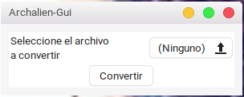
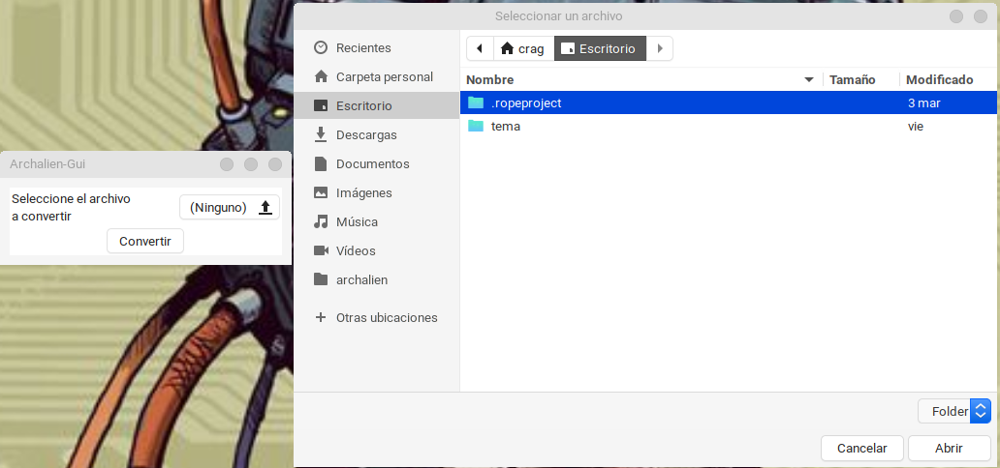
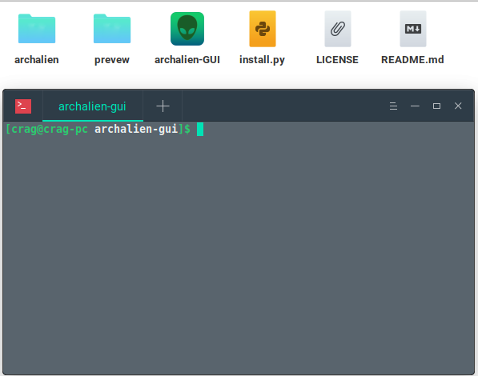
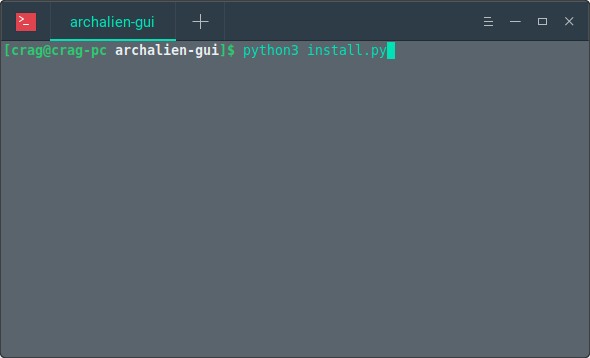

### Archalien-Gui

* GUI de archalien

[proyecto archalien](https://github.com/Asher256/archalien "proyecto archalien")

* thanks to the archalien project

## preview

## requirements

1.- gtk3

2.- python3

## instalation

1.- clone the repository or download it in a file cabinet

2.- there will be a terminal inside the folder

3.- write "python3 install.py"

### how to use
1.- look for the deb or rpm file that you want to convert

2.- click on the "convertir" button
